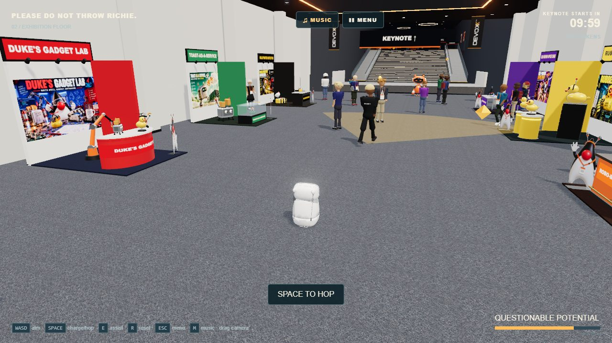
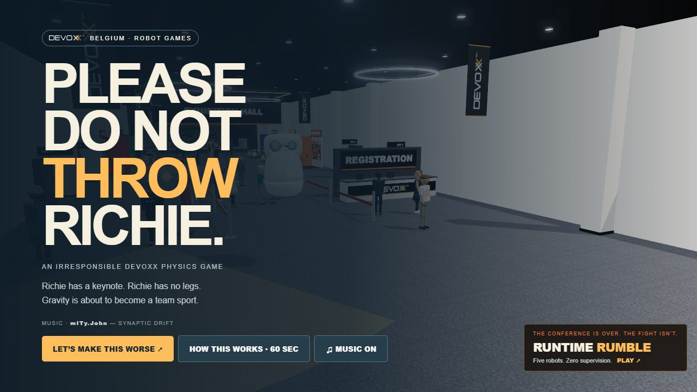
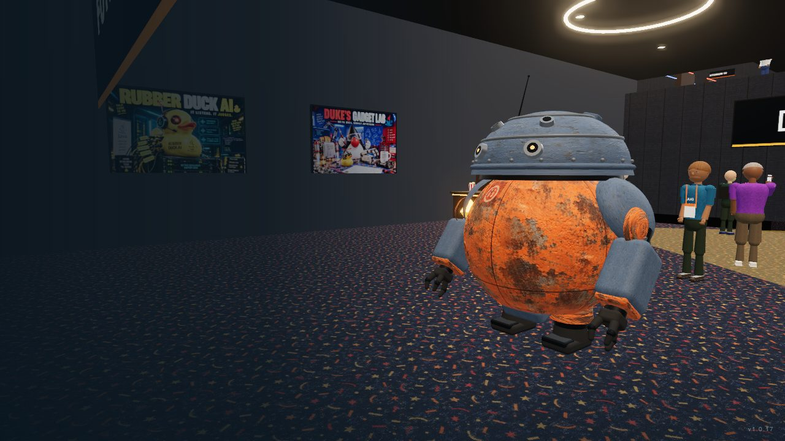
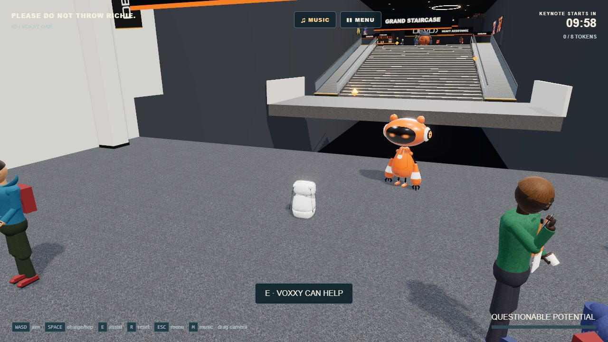
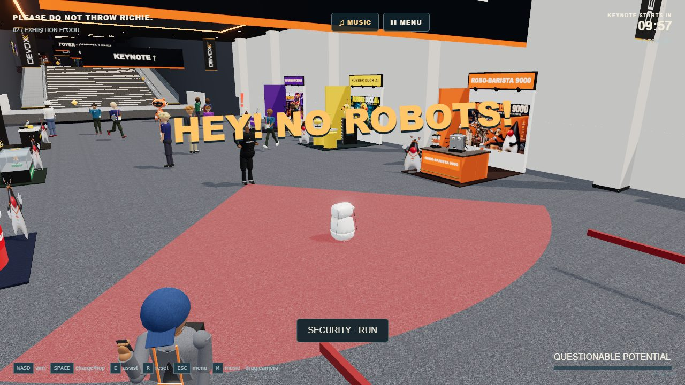
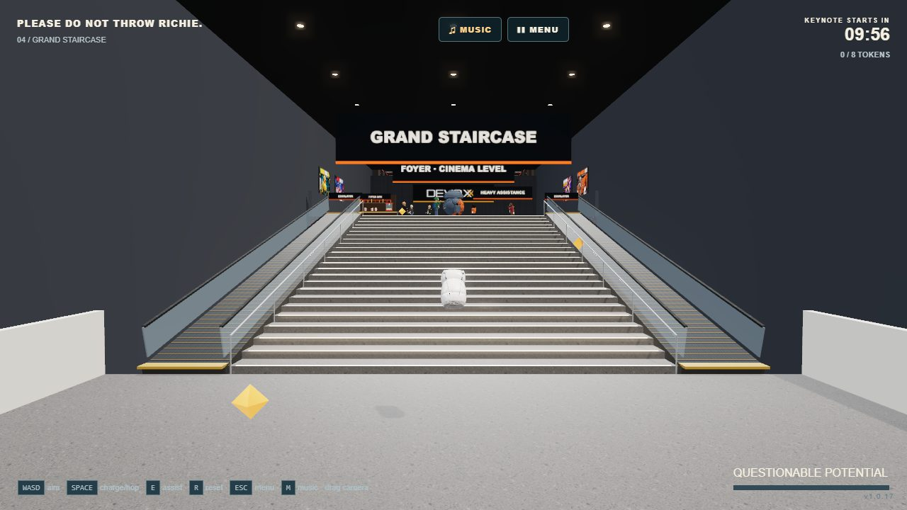
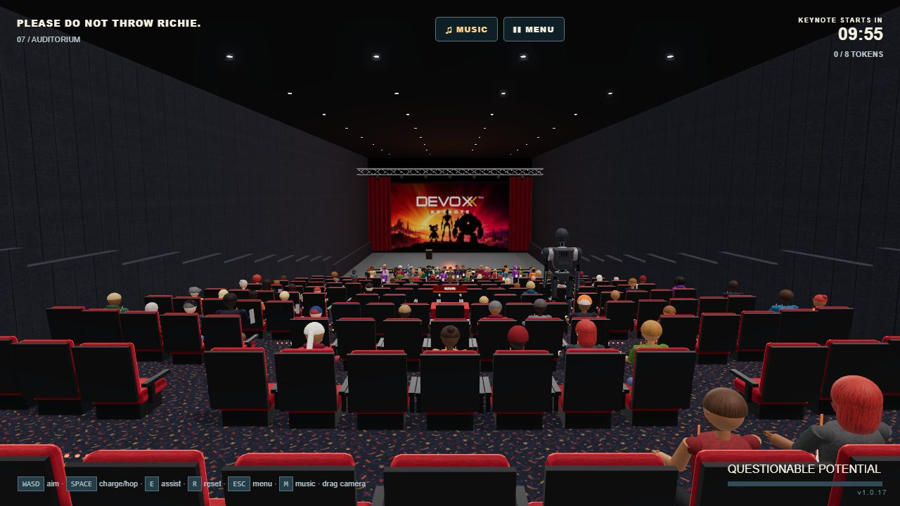
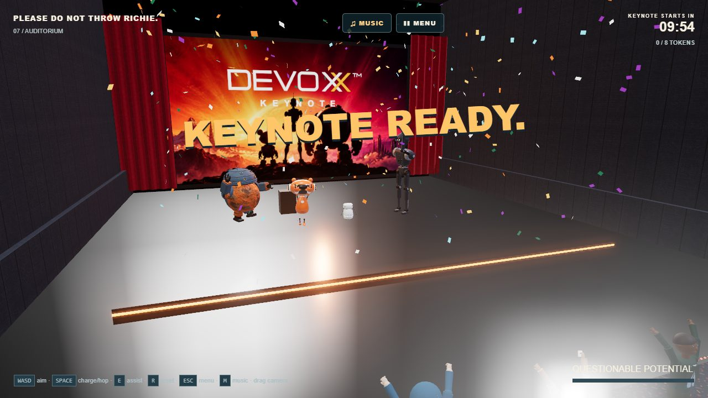
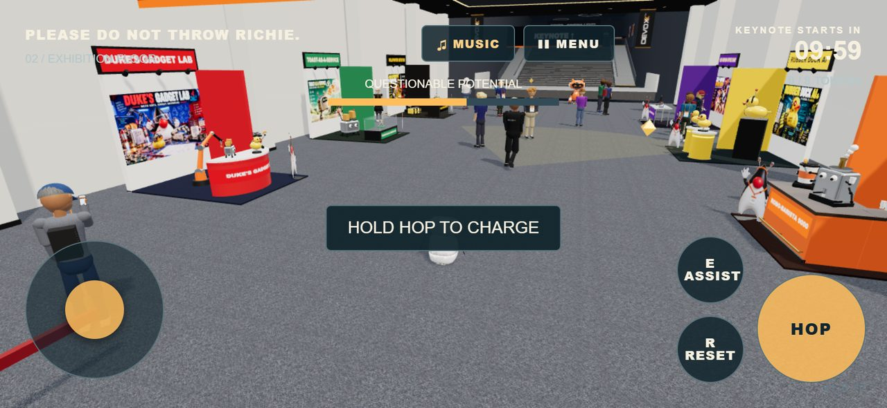

<div align="center">

# PLEASE DO NOT THROW RICHIE

### An irresponsible Devoxx physics game

**Richie has a keynote. Richie has no legs.**
*Gravity is about to become a team sport.*

[**▶ PLAY IT IN YOUR BROWSER**](https://janvanwassenhove.github.io/PleaseDoNotThrowRichie/) · or *Add to Home Screen* and **▶ PLAY IT AS AN APP**

[](https://janvanwassenhove.github.io/PleaseDoNotThrowRichie/)
[](https://github.com/janvanwassenhove/PleaseDoNotThrowRichie/releases)
[](https://github.com/janvanwassenhove/PleaseDoNotThrowRichie/actions)
[](LICENSE)
[](https://janvanwassenhove.github.io/PleaseDoNotThrowRichie/)

No account. No backend. No app store. One tab, ten minutes — or install it from that tab and it lives on your phone, and plays with no signal at all.



</div>

---

## Ten minutes to the keynote

The keynote starts in ten minutes. It is in **Auditorium 8** — upstairs, at the far end of Kinepolis Antwerp. Richie is down at registration.

Richie has no legs. No wheels. No arms. He has two expressive antennas and an unfortunate relationship with gravity, and his entire movement repertoire is:

# HOP

So you hop. Then the floor runs out, and you discover that Voxxy can *throw* him. Then a wall turns up, and Biggy can *hit* him. Then a cinema chair ejects him across a room. By the end you are flinging a €500 research robot into a crowd of developers and hoping they catch.

The title was never a warning. It was a suggestion.

| | |
| --- | --- |
|  |  |
| **The pitch.** Richie hops through the title card, because of course he does. | **Sixty seconds of briefing.** Optional, skippable, shot live in the venue. |

## Meet the expedition

Four robots, four completely different ways of moving a legless robot through a cinema. Voxxy, Droid and Biggy are modelled on the official [Robot Games model sheets](https://game.devoxx.be/references.html); Richie is the real [Reachy Mini](https://github.com/pollen-robotics/reachy_mini) geometry.

| Robot | Role | What it does to Richie |
| --- | --- | --- |
| **Richie** | the problem | Hops. Tumbles. Faceplants. Gets up. |
| **Voxxy** | precision throw | Picks him up, aims, and launches him across the gap. |
| **Biggy** | maximum chaos | Reverses, builds momentum, and hits him into the next floor. |
| **Droid** | questionable machinery | Reclines a cinema seat. Twice politely. Then **EJECT MODE**. |

| | |
| --- | --- |
|  |  |
| **Voxxy throws.** The first throw is almost impossible to miss. The later ones are not. | **Security throws back.** Four guards, real vision cones, real line of sight. |

## The route

Registration → the exhibition floor → Voxxy's gap → the grand staircase → Biggy's launch → the cinema corridor → Auditorium 8 → the crowd → the stage. Eight checkpoints, so a mistake costs seconds rather than the run.

The escalators either side of the staircase actually run, so there is a choice at the bottom: ride up slowly and safely, or hop the twenty-four steps and find out exactly how far down they go.

The venue is Kinepolis Antwerp as Devoxx uses it: the grey carpet of the exhibition hall under its orange cove, six sponsor stands selling robot gadgets nobody asked for, Duke waving from a cardboard standee beside every one, terrazzo stairs, confetti carpet upstairs, and a dark auditorium of red velvet raked down towards a lit screen.

| | |
| --- | --- |
|  |  |
| **The grand staircase.** Twenty-four steps. No legs. It goes how you think. | **Auditorium 8.** Twelve raked tiers of seats between Richie and the stage. |



## Two ways to play

**One build, two editions.** The game reads your device and rebuilds its own controls around it — there is no separate mobile version to download, and no desktop-only features hiding behind the phone one.

<table>
<tr>
<td width="58%">

### 💻 Laptop and desktop

Keyboard and mouse, the full visual pass: bloom on the light fittings and robot eyes, shadow-casting key light, 60 FPS on a normal recent laptop. Drag to orbit the camera, scroll to zoom.

| Action | Key |
| --- | --- |
| Aim | `W` `A` `S` `D` |
| Charge and hop | `SPACE` — hold, then release |
| Ask a nearby robot for help | `E` |
| Reset to the last checkpoint | `R` |
| Orbit / zoom the camera | Drag / scroll |
| Pause, or leave a run | `ESC` |
| Music on / off | `M` |
| Skip the opening | `SPACE`, `ENTER`, `E` or a tap |

</td>
<td width="42%">

### 📱 Phone and tablet

On-screen controls appear on their own: a stick to aim, a big **HOP** button to charge and release, **E**, **R**, and **MENU** to pause or leave. Landscape works best. Post-processing steps aside to keep the frame rate up.

It is a **PWA** — *Add to Home Screen* installs it like an app, and after one visit it runs completely offline on a train.

</td>
</tr>
</table>



Both editions are the same `dist/`. Input is one path internally — the touch buttons press the same key codes the keyboard does — so the physics never knows which device it is on.

**Requirements:** any browser with WebGL 2 and WebAssembly (Chrome, Edge, Firefox, Safari 15+). If either is missing or blocked, the page says so instead of going black. Add `?nofx` to the URL to switch the bloom pass off on a tired GPU.

## Built for the Devoxx Robot Games

This is a competition entry for the [Devoxx Belgium Robot Games](https://game.devoxx.be/), built with GenAI assistance from end to end — and documented that way, failures included.

- [**Game brief**](docs/GAME-BRIEF.md) — the original design brief the game was built from.
- [**Architecture**](docs/ARCHITECTURE.md) — how the physics, venue, robots and briefing fit together.
- [**Asset sources**](docs/ASSET-SOURCES.md) — every external asset, its licence and what was changed.
- [**AI development log**](docs/AI-DEVELOPMENT-LOG.md) — seventeen iterations, including the ones that went wrong.
- [**Prompts**](prompts/) — the prompts behind the implementation and the generated textures.

Richie is the official Reachy Mini geometry (Apache-2.0). Voxxy, Droid, Biggy, the crowd and the venue are procedural. The venue's textures and the sponsor posters were generated with ChatGPT. The Devoxx wordmark is used to identify the conference this entry is built for.

### Music

**Synaptic Drift** by **mITy.John** — written, performed and produced by the author of this game. Copyright © 2026 Jan Van Wassenhove, all rights reserved, and licensed for use **in this game only**: it is not covered by the MIT licence, and may not be reused, redistributed, remixed or sampled outside *Please Do Not Throw Richie*. See [the notice](src/assets/audio/NOTICE-synaptic-drift.md). Press `M` if you would rather hop in silence.

## Run it yourself

Node.js 22+ and npm.

```sh
npm ci           # install
npm run dev      # dev server, open the URL Vite prints
npm test         # vitest unit tests
npm run build    # type-check + production build to dist/
npm run preview  # serve the production build
```

`dist/` is a self-contained static site with relative asset paths, so it runs from a domain root, a project subpath or a local folder. Serve it over HTTP — ES modules and the physics WebAssembly will not load over `file://`. Every release also ships that build as a zip on the [releases page](https://github.com/janvanwassenhove/PleaseDoNotThrowRichie/releases).

**Stack:** TypeScript · Vite · Three.js · Rapier · WebGL 2 · vite-plugin-pwa.

<details>
<summary><b>Screenshots, Richie's model, textures and icons</b></summary>

```sh
npx playwright install chromium   # once
npm run screenshots               # writes screenshots/*.png, including the phone one
```

`scripts/screenshots.mjs` boots a real Vite server and drives the game through the `window.__richie` debug hook in `src/main.ts` rather than synthesising input, so captures are deterministic. On a machine that already has a Chromium build, point `CHROMIUM_PATH` at it instead of installing another one.

Richie is the official [Reachy Mini](https://github.com/pollen-robotics/reachy_mini) geometry (Apache-2.0, see `src/assets/NOTICE-reachy-mini.md`), converted to `src/assets/richie.glb`:

```sh
pip install numpy scipy trimesh fast-simplification
pip download reachy-mini --no-deps -d /tmp/rm && (cd /tmp/rm && unzip -q *.whl)
python3 scripts/build-richie.py /tmp/rm/reachy_mini/descriptions/reachy_mini/mjcf src/assets/richie.glb
```

The wheel, not the git checkout: the repository keeps its STLs in Git LFS. Voxxy, Droid and Biggy (`src/robots.ts`) are procedural models of the [Robot Games model sheets](https://game.devoxx.be/references.html); the conference crowd (`src/people.ts`) and the venue (`src/venue.ts`) are procedural too — the crowd is one material whose map is an atlas of generated skin, cloth, hair and leather (`prompts/003-people.md`). Textures live in `src/assets/textures/`; `python scripts/import-texture.py <name> [--tile] [--alpha] [--crop 3x2]` brings a new generated image in. See [asset sources](docs/ASSET-SOURCES.md). `npm run icons` re-renders the PWA icons from `public/favicon.svg`.

</details>

<details>
<summary><b>Deployment and releases</b></summary>

Four workflows, all in `.github/workflows/`:

- **`ci.yml`** — tests and builds every push and pull request.
- **`deploy.yml`** — publishes `dist/` to GitHub Pages on every push to `main`, and again when a release is published so the live version badge matches the newest release. Enable it once under *Settings → Pages → Build and deployment → Source: GitHub Actions*.
- **`release.yml`** — every push to `main` cuts a patch release: it runs the tests, captures the screenshots and zips the built site (both from a checkout bumped to the version it is becoming), and only then bumps `package.json` for real, tags it and publishes a GitHub Release with the screenshots, the zip and a changelog generated from the commits since the last published release. Nothing is tagged unless everything before it succeeded. Use the workflow's *Run workflow* button for a minor or major bump, or put `[skip release]` in a commit message to skip one.
- **`tidy-artifacts.yml`** — weekly cleanup of leftover Actions artifacts.

</details>

---

<div align="center">

**No robots were harmed in the making of this game.**
*Richie disagrees.*

MIT licensed, except the music · [Play it](https://janvanwassenhove.github.io/PleaseDoNotThrowRichie/) · [Report a bug](https://github.com/janvanwassenhove/PleaseDoNotThrowRichie/issues)

</div>
